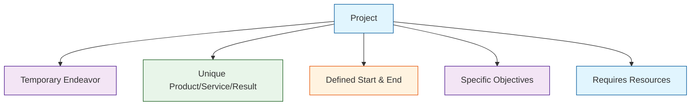
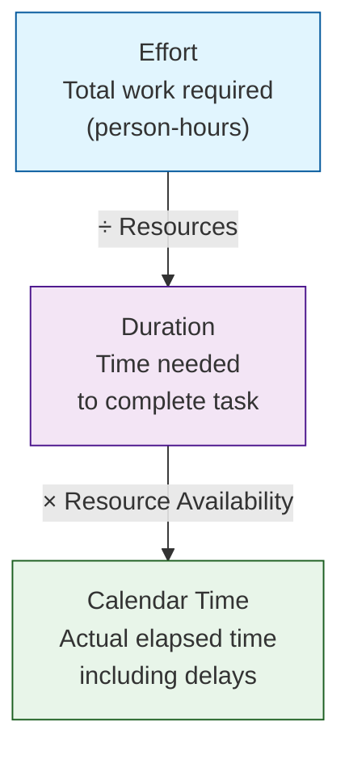

---
tags:
  - EGE322
  - IoT
  - project-management
  - tutorial
course: EGE322 IoT System Project
topic: Tutorials 1-3 — Project Management
---

> 📚 **Related:** [[Week 1|Week 1 Overview]] | [[Chap2_ProjectMgt|Chapter 2: Project Management]]

---

# Tutorials 1
Q1: Define a project. You shoudl provide an illustation in support of your definition
A: A project is a temporary endeavor undertaken to create a unique product, service, or result. It has a defined beginning and end, specific objectives, and requires resources. Projects are distinct from ongoing operations because they have a clear scope and deliverables.

Diagram:

Q2: Illustrate witha n example for each of teh follwing:
Duration of your project schedule is decreased
A: Deadline moved up
Budget (cost) of your project is decreased
A: Budget cut, price hike, tariff increase
your project scope is increased
A: client requests more features

Q3: It is state that building a custom house is a project but building the stadnard hosue is a business procss. Compare and contrast a project and busness process.
A: A project has a clear start and end, is a "one off", and has unique end prouct. A busness process is a repeated set of things that lead to a consistent outcome.

Q4: state the four phases in the full cycle of projet life
A: Initiation, Planning, Execution, Closure

Tutorial 2
Q1: Describe the beenfirs of intiatin and organising a project
A:clear direction and goals, ensures time, moeny, and people are allocated efficientyl

Q2: Describe 5 possibilites leading to projects being autorised. give an example for each
A: 
- Market demans: companies want new and specific solutions
- organisational need: an organisation begins a new program to promote a certain tech
- customer requst: a client specifically aksks for something
- new tech: new technological advances allows for previously unreasonable projects
- complaince with new laws: new law requred a change in procedures/tech

Q3: explain SWOT analytical tool which can be used to asses the feasibilit of a projext
A: Strength, wakness, opportunity, threat. -> helps identify internal and external factors that can impact project success, analyse feasabilty and helps project manager make informed decision and allcoate resources well

Q4: Explain the 3 steps for organising a project team.
A: Define roles and responsibilites, select team memebres, establish structure and communciation

Q5 Explain teh purpose of establishing a Flexibilty Matrx.
A: Priooritise scope, timem, and cost.

Q6: Statehte purpose of a project charter. Your description shoudl incdue the categories found in a project scharter. 
A: A Project Charter is a formal document that authorises a project and gives the project manager the authority to proceed. It serves as a reference point for scope, objectives, and stakeholders throughout the project.
Categories typically found in a Project Charter:
 • Project title and description
 • Project objectives and goals
 • Scope (what is included/excluded)
 • Stakeholders and roles
 • Budget and resource allocation
 • Timeline / key milestones
 • Risks and assumptions
 • Approval/sign-off signatures 

Tutorial 3
Q1: Define work breakdown structure (WBS) and state its purpose. Your answer should include some attributes of WBS.
A: Work breakdown structure: Is a way to organise the work required for a project in a structured way -> making sure htat all worok that needs to be done for the project is well defined and written by surprise (ensure there is a lower chance of suddenly having more work). sequence is not impt, ipmt is that ALL the work is there, (idk what "verb noun" symbolises task adn activity means) (ASNWER FROM CHER: Theory: wehn we define task, use verb and nounes -> define ideal outcome with verbs ad nounds "like learning outcome:), and each breakdown needs at least 2 tasks

Q2: Describe the top-down approcah used in developing a Work BReakdwon Struucture(WBS)
A: First, iIdentify 4-7 major components, then group by product deliverables, lie cycle phases, funcitonal responsibilities, or geogrphic location (need to clear up on this). Then validate using a bototm up approach, - developing WBS is a team effort

Q3: Describe how the duration of each task in a project can be approximated. illustrate with the help of a diagram the relationship of the following: effor, duration, Calendar time

A: Duration approximation relies on **previous experience and documented history**. Key principles:
- Durations are assigned by the **owners** of the tasks
- Padding should be avoided — use the **most likely duration**
- All assumptions should be documented
- Number of persons and training requirements should be documented

The relationship between Effort, Duration, and Calendar Time:
- **Effort** — total work required (person-hours); used for charging purposes (what does charging purposes mean?) (ANs: like salary etc -> paying ppl)
- **Duration** — time needed to complete the task; used for schedule purposes (considers productivity & wait time). Derived from Effort ÷ Resources
- **Calendar Time** — actual elapsed real-world time; used for planning and tracking (considers non-working days, weekends, holidays). Derived from Duration × Resource Availability

Diagram:

Q4 State the areas covered by teh project execution, control, and monitoring. You should also highlight the benefits of this pahse in project management.
A: Monitoring the environment, Managing change, tracking and communicating progress. It give a clear indication fo progress, wiht keeps everybody up to date, and encourages that all problem areas are highlighted and identified. It updates and keeps completion estimates reasoable.

Q5: What are the key considerations before a projet closure?
A: Announing the end, conducting a final reveiw, debgreifing, acknowledgement and rewards, closing rituil (party?) coplete all remaining paperwork -> contract, paymnet, schedule upddate, document lessons learn, and closign the project file.