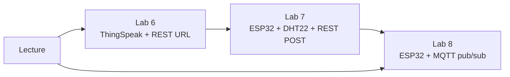

> **Related:** [[iot-data-collection-mqtt-rest-api-cloud-services-slides|Lecture — MQTT & REST]] | [[ege322-lab-6-introduction-to-thingspeak-slides|Lab 6 PDF]] | [[ege322-lab-7-esp32-thingspeak-slides|Lab 7 PDF]] | [[ege322-lab-8-mqtt-adafruit-io-slides|Lab 8 PDF]] | [[ESP32_Programming_Guide|ESP32 Guide]] | [[05-KB/concepts/MQTT|MQTT concept]]

# EGE322 Labs 6–8 — Follow-Along Guide

One path through all three labs plus the lecture topics. Do them **in order** — each lab builds on the last.

**Time estimate:** Lab 6 ≈ 45 min (PC only) · Lab 7 ≈ 90 min · Lab 8 ≈ 90 min

---

## What you'll learn (topic map)



| Topic | Lab | Key idea |
|-------|-----|----------|
| IoT cloud platform | 6, 7 | ThingSpeak stores sensor data in **channels/fields** |
| REST API (HTTP POST) | 6, 7 | **Request-response** — ESP32 sends data, server replies once |
| WiFi on ESP32 | 7, 8 | `network.WLAN(STA_IF)` + credentials file |
| DHT22 + OLED | 7 | Read sensor locally, optional cloud upload |
| MQTT publish | 8 | **Uplink** — ESP32 pushes temp/hum to cloud feeds |
| MQTT subscribe | 8 | **Downlink** — dashboard switch controls ESP32 LED |
| Adafruit IO | 8 | Feeds + dashboard widgets over MQTT |

---

## Before you start — checklist

### Accounts (create once, reuse)

- [ ] **ThingSpeak** — [thingspeak.com](https://thingspeak.com/) (MathWorks account)
- [ ] **Adafruit IO** — [io.adafruit.com](https://io.adafruit.com/) (free Adafruit account)

### Hardware (Labs 7 & 8)

| Item | Notes |
|------|-------|
| ESP32 NodeMCU | USB data cable (not charge-only) |
| DHT22 | 3.3 V only — do not use 5 V |
| 0.96" OLED (I2C) | SDA/SCL wiring |
| Breadboard + jumpers | |
| WiFi | 2.4 GHz network (ESP32 does not do 5 GHz-only routers) |

### Software

- [ ] **Thonny** installed, ESP32 on correct COM port
- [ ] MicroPython firmware flashed ([[ESP32_Programming_Guide|ESP32 Guide]])
- [ ] Libraries on ESP32: `ssd1306`, `dht` (built-in), `urequests`, `umqtt.robust`

Install missing libs in Thonny → **Tools → Manage packages** (on the ESP32 interpreter), or copy `.py` files to the board.

### Credential files (never commit to Git)

Create these on the ESP32 only — keep API keys private.

---

# Lab 6 — ThingSpeak + REST API (browser only)

**Goal:** Create a cloud channel and push fake sensor data using a URL in Chrome.

## Step 1 — Register

1. Go to [thingspeak.com](https://thingspeak.com/) → **Sign Up**
2. Verify email → **Sign In**

## Step 2 — Create channel

1. **Channels → My Channels → New Channel**
2. Name: e.g. `EGE322 Lab6`
3. Tick **Field 1–4**, set names:

| Field | Name |
|-------|------|
| field1 | Temperature |
| field2 | Humidity |
| field3 | Luminosity |
| field4 | PIR |

4. **Save Channel**

## Step 3 — Explore tabs

Open your channel and click each tab once so you know where things live:

- **Private View** — your live charts
- **API Keys** — copy **Write API Key** (needed in Lab 7)

## Step 4 — REST API from browser

Paste in Chrome address bar (replace `YOUR_WRITE_KEY`):

```
	http://api.thingspeak.com/update?api_key=2EIDLLVI722CKFIE&field1=25
```

- Browser shows a number (entry ID) → success
- Switch to **Private View** tab → **refresh** → Temperature chart updates
- Repeat for all fields:

```
&field1=25&field2=60&field3=500&field4=1
```

## Step 5 — Understand what happened

- **REST = HTTP request-response.** Browser sent a **POST-like update** via GET URL; ThingSpeak stored one row.
- **field1–field4** map to the names you set — order matters, not the label text.
- Free tier: ~15 s between updates; don't spam faster.

## Lab 6 done when

- [ ] Channel shows 4 charts
- [ ] You updated all 4 fields via URL
- [ ] You saved your **Write API Key** somewhere safe (password manager / local note, not Git)

---

# Lab 7 — ESP32 → ThingSpeak (REST POST)

**Goal:** Read real DHT22 data on ESP32, show on OLED, upload to ThingSpeak every 5 s.

## Step 1 — ThingSpeak channel (Lab 7)

You can reuse Lab 6 channel or create a new one with **only 2 fields**:

| Field | Name |
|-------|------|
| field1 | Temperature |
| field2 | Humidity |

Copy **Write API Key** from **API Keys** tab.

## Step 2 — Wire hardware (Lab 7 pins)

| DHT22 pin | Connect to ESP32 |
|-----------|------------------|
| 1 VDD | 3.3V |
| 2 DATA | **GPIO 15** |
| 3 NC | — |
| 4 GND | GND |

| OLED pin | Connect to ESP32 |
|----------|------------------|
| GND | GND |
| VDD | 3.3V |
| SCK | **GPIO 22** |
| SDA | **GPIO 21** |

## Step 3 — Test sensor + OLED first

Save as `dht_oled_test.py` on ESP32 and run. Fix wiring until values print in Thonny shell.

```python
from machine import Pin, I2C
from ssd1306 import SSD1306_I2C
from time import sleep
import dht

sensor = dht.DHT22(Pin(15))
i2c = I2C(scl=Pin(22), sda=Pin(21))
oled = SSD1306_I2C(128, 64, i2c, 0x3c)

while True:
    try:
        sensor.measure()
        oled.fill(0)
        oled.text('Temp: %.1f C' % sensor.temperature(), 0, 0)
        oled.text('Hum:  %.1f %%' % sensor.humidity(), 0, 16)
        oled.show()
        print(sensor.temperature(), sensor.humidity())
        sleep(3)
    except OSError:
        print('DHT22 read failed — check wiring')
        sleep(3)
```

**OLED glitch fix (Lab exercise 3):** Always `oled.fill(0)` before drawing new text so old digits don't ghost.

## Step 4 — WiFi credentials

Save as `wifi_credentials.py` on ESP32:

```python
ssid = 'YOUR_WIFI_NAME'
password = 'YOUR_WIFI_PASSWORD'
```

Connect ESP32 to **2.4 GHz** WiFi. Test in shell:

```python
import network, wifi_credentials
sta = network.WLAN(network.STA_IF)
sta.active(True)
sta.connect(wifi_credentials.ssid, wifi_credentials.password)
while not sta.isconnected(): pass
print(sta.ifconfig())
```

## Step 5 — Full Lab 7 script

Save as `main.py` (or `thingspeak_post.py`):

```python
import network
import wifi_credentials
import urequests
import dht
import time
from machine import Pin, I2C
from ssd1306 import SSD1306_I2C

# --- config ---
THINGSPEAK_WRITE_API_KEY = 'PASTE_YOUR_WRITE_KEY'
UPDATE_MS = 5000

# --- hardware ---
led = Pin(2, Pin.OUT)
sensor = dht.DHT22(Pin(15))
i2c = I2C(scl=Pin(22), sda=Pin(21))
oled = SSD1306_I2C(128, 64, i2c, 0x3c)


def dht22():
    """Lab 7 exercise 2 — wrap sensor read."""
    sensor.measure()
    return sensor.temperature(), sensor.humidity()


def show_oled(t, h):
    oled.fill(0)
    oled.text('ThingSpeak', 0, 0)
    oled.text('T: %.1f C' % t, 0, 18)
    oled.text('H: %.1f %%' % h, 0, 34)
    oled.show()


def connect_wifi():
    sta = network.WLAN(network.STA_IF)
    if sta.isconnected():
        return
    sta.active(True)
    sta.connect(wifi_credentials.ssid, wifi_credentials.password)
    while not sta.isconnected():
        time.sleep(0.2)
    print('WiFi OK:', sta.ifconfig()[0])


connect_wifi()
last = time.ticks_ms()
headers = {'Content-Type': 'application/json'}

while True:
    if time.ticks_ms() - last >= UPDATE_MS:
        try:
            t, h = dht22()
            show_oled(t, h)
            payload = {'field1': t, 'field2': h}
            url = 'http://api.thingspeak.com/update?api_key=' + THINGSPEAK_WRITE_API_KEY
            r = urequests.post(url, json=payload, headers=headers)
            r.close()
            print('Uploaded:', payload)
            led.value(not led.value())
        except OSError:
            print('Sensor error')
        last = time.ticks_ms()
    time.sleep(0.1)
```

Run → Thonny prints uploads → refresh ThingSpeak **Private View** (~15 s).

## Step 6 — Lab 7 reflection (know for test)

| Question | Answer |
|----------|--------|
| Why `sensor.measure()` first? | DHT22 needs a trigger read before values are valid |
| Why `Content-Type: application/json`? | Tells server the POST body is JSON so it parses `field1`, `field2` |
| How does TS know field1 = temp? | **You** map it in the JSON dict — field number = channel field slot |
| What does `urequests.post()` do? | Opens HTTP connection, sends POST, gets response |
| Why `request.close()`? | Frees socket/memory on ESP32 (limited resources) |

## Lab 7 done when

- [ ] OLED shows live temp/humidity
- [ ] ThingSpeak charts update from ESP32 (not just browser URL)
- [ ] Onboard LED (GPIO 2) toggles each upload
- [ ] You can explain REST vs "just printing to serial"

---

# Lab 8 — Adafruit IO + MQTT (pub/sub + remote LED)

**Goal:** Dashboard gauges for temp/humidity; dashboard switch turns ESP32 LED on/off via MQTT.

## Step 1 — Adafruit IO dashboard

1. [io.adafruit.com](https://io.adafruit.com/) → Sign in
2. **+ Dashboard** → name e.g. `EGE322 Lab8`
3. **Create New Block → Gauge** → create feed **`temp`** → finish block
4. Repeat for feed **`hum`**
5. **Create New Block → Toggle Switch** → feed **`light`** (ON=1, OFF=0)
6. **Edit layout** → arrange widgets → **Save**

## Step 2 — Get MQTT credentials

1. Click your profile → **My Key**
2. Copy **Active Key** (this is your MQTT password)
3. Note your **Adafruit username** (shown on dashboard)

Feed names in code **must match** dashboard: `temp`, `hum`, `light`.

## Step 3 — Rewire for Lab 8

Lab 8 uses **different pins** than Lab 7:

| Component | GPIO |
|-----------|------|
| DHT22 DATA | **16** |
| LED (external or use onboard) | **4** (lab) or **2** (onboard) |

OLED is optional in Lab 8 — focus on MQTT + LED control.

## Step 4 — Credentials file

Save as `credential.py` on ESP32:

```python
ssid = 'YOUR_WIFI_NAME'
password = 'YOUR_WIFI_PASSWORD'
adafruit_username = b'your_adafruit_username'
adafruit_IO_key = b'your_active_io_key'
```

## Step 5 — Full Lab 8 script

Save as `main.py`:

```python
from machine import Pin
import network
import time
import os
import sys
import dht
from umqtt.robust import MQTTClient
import credential

# --- hardware (Lab 8 pins) ---
sensor = dht.DHT22(Pin(16))
led = Pin(4, Pin.OUT)

PUBLISH_EVERY_S = 10
CHECK_EVERY_S = 0.5


def cb(topic, msg):
    """Downlink — dashboard switch → LED."""
    print('Subscribe:', topic, msg)
    try:
        message = msg.decode('utf-8').strip().lower()
        if message in ('1', 'on', 'true'):
            led.value(1)
        else:
            led.value(0)
    except Exception as e:
        print('Callback error:', e)


def connect_wifi():
    ap = network.WLAN(network.AP_IF)
    ap.active(False)
    wifi = network.WLAN(network.STA_IF)
    wifi.active(True)
    wifi.connect(credential.ssid, credential.password)
    for _ in range(20):
        if wifi.isconnected():
            print('WiFi OK:', wifi.ifconfig()[0])
            return
        time.sleep(1)
    print('WiFi failed')
    sys.exit()


def connect_mqtt():
    client_id = b'esp32_' + bytes(str(int.from_bytes(os.urandom(3), 'little')), 'utf-8')
    client = MQTTClient(
        client_id=client_id,
        server=b'io.adafruit.com',
        user=credential.adafruit_username,
        password=credential.adafruit_IO_key,
        ssl=False,
    )
    client.connect()
    client.set_callback(cb)

    user = credential.adafruit_username
    temp_feed = b'%s/feeds/temp' % user
    hum_feed = b'%s/feeds/hum' % user
    light_feed = b'%s/feeds/light' % user

    client.subscribe(light_feed)  # downlink
    return client, temp_feed, hum_feed


connect_wifi()
client, temp_feed, hum_feed = connect_mqtt()
accum = 0.0

while True:
    try:
        if accum >= PUBLISH_EVERY_S:
            sensor.measure()
            t = sensor.temperature()
            h = sensor.humidity()
            client.publish(temp_feed, bytes(str(t), 'utf-8'), qos=0)
            client.publish(hum_feed, bytes(str(h), 'utf-8'), qos=0)
            print('Published T=%s H=%s' % (t, h))
            accum = 0.0

        client.check_msg()  # must run often for downlink
        time.sleep(CHECK_EVERY_S)
        accum += CHECK_EVERY_S

    except KeyboardInterrupt:
        client.disconnect()
        break
```

## Step 6 — Test uplink then downlink

1. **Run script** → Thonny shows `Published T=… H=…`
2. Open Adafruit dashboard → gauges should move within ~10 s
3. **Toggle the Light switch** → ESP32 LED should follow
4. If LED doesn't respond: check feed name `light`, callback registered, `check_msg()` in loop

## Step 7 — Lab 8 reflection (know for test)

| Question | Answer |
|----------|--------|
| Publish vs subscribe code? | `client.publish(temp_feed, …)` vs `client.subscribe(light_feed)` + `cb()` |
| Purpose of `cb()`? | Runs when subscribed topic gets a message (downlink handler) |
| How message controls LED? | Decode msg → if `'1'`/`'on'` → `led.value(1)` else off |
| Feed names must match? | MQTT topic = `username/feeds/feedname` — typo = no data |
| Why `credential.py`? | Keeps secrets out of main code / Git |
| Why publish every 10 s? | Rate limits, bandwidth, power; sensor doesn't change instantly |
| Why `check_msg()` in loop? | MQTT is async — must poll for incoming commands |

## Lab 8 done when

- [ ] Gauges show live DHT22 data
- [ ] Dashboard switch controls ESP32 LED
- [ ] You can draw uplink vs downlink on paper
- [ ] You can explain why MQTT fits real-time IoT better than REST polling

---

# Lecture topics — quick revision

Cover these after Labs 6–8 (see [[iot-data-collection-mqtt-rest-api-cloud-services-slides|lecture slides]]):

## REST API methods

| Method | Use |
|--------|-----|
| GET | Read data |
| POST | Send/create data ← **Labs 6 & 7** |
| PUT | Update |
| DELETE | Remove |

## MQTT QoS

| QoS | Name | When |
|-----|------|------|
| 0 | At most once | Sensor streams (Lab 8 publish) |
| 1 | At least once | Commands (may duplicate) |
| 2 | Exactly once | Critical control/billing |

## REST vs MQTT (exam favourite)

| | REST | MQTT |
|---|------|------|
| Model | Request-response | Publish-subscribe |
| Connection | Short (per request) | Long-lived |
| Best for | Config, one-off updates | Streaming, remote control |

---

# Troubleshooting

| Problem | Fix |
|---------|-----|
| DHT22 `OSError` | Wait 2 s between reads; check 3.3 V; add 10 kΩ pull-up DATA→3.3V |
| OLED blank | Run `i2c.scan()` — expect `0x3c`; try swapping SDA/SCL |
| WiFi won't connect | 2.4 GHz only; check SSID/password; move closer to router |
| ThingSpeak `0` response | Rate limit — wait 15 s; check API key |
| Adafruit gauges flat | Wrong username/key; feed names mismatch; script not publishing |
| Switch doesn't toggle LED | Feed must be `light`; `subscribe()` before loop; `check_msg()` every loop |
| `urequests` / `umqtt` missing | Install via Thonny package manager or copy lib to ESP32 |

---

# Master checklist — all topics covered

## Cloud platforms
- [ ] ThingSpeak channel, fields, API keys
- [ ] Adafruit IO dashboard, feeds, blocks, Active Key

## Protocols
- [ ] REST URL update (browser)
- [ ] REST POST with JSON (`urequests`)
- [ ] MQTT publish (uplink)
- [ ] MQTT subscribe + callback (downlink)

## ESP32 skills
- [ ] WiFi STA mode + credentials file
- [ ] DHT22 read with `measure()`
- [ ] OLED I2C display
- [ ] GPIO LED control from cloud

## Concepts
- [ ] field1/field2 mapping
- [ ] HTTP headers (`Content-Type`)
- [ ] MQTT topic format `user/feeds/name`
- [ ] QoS 0/1/2 differences
- [ ] When to use REST vs MQTT

---

## Suggested next

- [ ] Add Lab 6–8 scripts to [[EGE322 Lab Code Reference]] after you verify on hardware
- [ ] Flashcards from reflection tables above
- [ ] Assignment 2 Part 4 (MQTT) reuses Lab 8 patterns — compare when you get there
