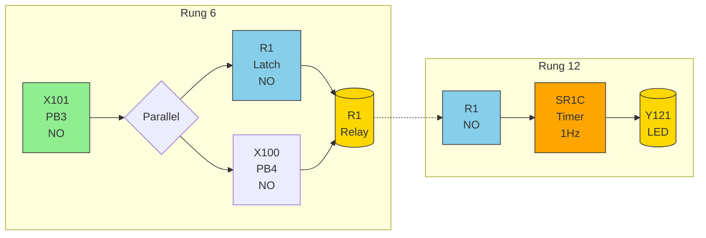
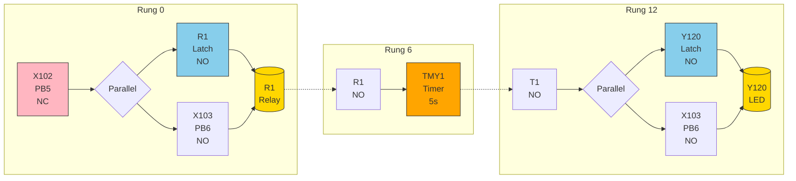
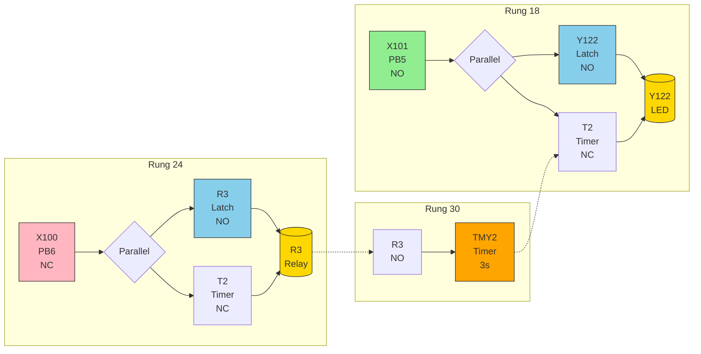

---
tags:
  - EGE351
  - lab
  - PLC
  - lab2
  - programming
  - PLC-programming-2
course: EGE351 Automation Systems & Control
topic: Lab 2 - PLC Programming 2
source: 14S1 EGE351 Lab 2 - Automation - PLC Programming 2_v1-1.pdf
converted: 2026-04-29
type: Lab
status: Completed
source: NYPY3 Import
---

> 📚 **Related:** [[NYPY3 - Main Index|NYPY3 Index]] | [[03-RESOURCES/EGE351-Automation-Systems-Control/EGE351_Lab_1_PLC_Programming.md|Lab 1]] | [[📅 Schedule & Assessments Dashboard|Assessment Dashboard]]

# Lab 2: Automation – PLC Programming 2

**School of Engineering**  
Diploma in Electronic and Computer Engineering  
Module: EGE351 Automation Systems & Control

---

## Student Information

- **Name:**
- **Team Members:**
- **Module Group:**
- **Date Submitted:**

---

## Objectives

- **a)** Understand and apply a latching PLC program
- **b)** Understand and apply a PLC Timer

---

## Equipment

- Programmable Logic Controller PLC FP7

## Components

- Input/Output devices

---

## Lab Tasks

Write and test the following PLC programs:

### Task 1: Latching Circuit

Write a PLC program to turn on an LED (Y120) when a normally-open pushbutton (PB1) is pressed. The LED turns off when another normally-open pushbutton (PB2) is pressed.

### Task 2: Blinking LED with Timer

Write a PLC program to blink an LED (Y121) at 1Hz when a normally-open pushbutton (PB3) is pressed. The LED turns off when another normally-closed pushbutton (PB4) is pressed.

### Task 3: Delayed Turn-On

Write a PLC program to turn an LED (Y122) after 5 seconds, when a normally-open pushbutton (PB5) is pressed. The LED turns off when another normally-open pushbutton (PB6) is pressed.

### Task 4: Delayed Turn-Off

Write a PLC program to turn an LED (Y122) when a normally-open pushbutton (PB5) is pressed. The LED turns off after 3 seconds, when another normally-open pushbutton (PB6) is pressed.

---

## Understandings

### Question 1

Write and explain a latching PLC program.

### Question 2

Describe the operation of a PLC Timer.

### Question 3

A PB1 (NO) is connected to Timer1. What is the value of T1 if PB1 is released after preset value of the timer.

---

## My Solutions

### Task 1: Latching Circuit (Rung 0)

**I/O Mapping:**
- PB1 → X103 (Normally Open)
- PB2 → X102 (Normally Closed in circuit)
- LED → Y120

<details>
<summary>Ladder Diagram (Mermaid - Click to expand)</summary>

```mermaid
flowchart LR
    A[X103<br/>PB1<br/>NO] --> B{Parallel}
    B --> C[Y120<br/>Latch<br/>NO]
    B --> D[/X102<br/>PB2<br/>NC]
    C --> E[(Y120<br/>LED)]
    D --> E
    style A fill:#90EE90,stroke:#333
    style C fill:#87CEEB,stroke:#333
    style D fill:#FFB6C1,stroke:#333
    style E fill:#FFD700,stroke:#333
```

</details>

**Ladder Diagram (ASCII):**
```
     X103     Y120     Y120
|----[ ]----+----[ ]----( )----|
|           |
|     /X102 |
|----[ ]----+
```

**Operation:** Press PB1 (X103) to turn on Y120. Y120 latches itself on through the parallel branch. Press PB2 (X102) to break the latch and turn off Y120.

---

### Task 2: Blinking LED with Timer (Rung 6 & 12)

**I/O Mapping:**
- PB3 → X101 (Normally Open)
- PB4 → X100 (Normally Open)
- LED → Y121
- Timer → SR1C

<details>
<summary>Ladder Diagram (Mermaid - Click to expand)</summary>



</details>

**Ladder Diagram (ASCII):**
```
Rung 6:
     X101      R1      R1
|----[ ]----+----[ ]----( )----|
|          |
|     X100 |
|----[ ]----+

Rung 12:
     R1     SR1C     Y121
|----[ ]----[ ]------( )----|
```

**Operation:** Press PB3 (X101) to turn on internal relay R1. R1 activates timer SR1C which controls Y121 blinking at 1Hz. Press PB4 (X100) to turn off R1 and stop the blinking.

---

### Task 3: Delayed Turn-On (Rung 0 & 6)

**I/O Mapping:**
- PB5 → X102 (Normally Closed in circuit)
- PB6 → X103 (Normally Open)
- LED → Y120
- Timer → TMY1 (U5 = 5 seconds)

<details>
<summary>Ladder Diagram (Mermaid - Click to expand)</summary>



</details>

**Ladder Diagram (ASCII):**
```
Rung 0:
     X102           R1
|----[ ]--------+---( )----|
|               |
|     R1   X103 |
|----[ ]----[/]-+

Rung 6:
     R1
|----[ ]----[TMY1][U5]--------|

Rung 12:
     T1              Y120
|----[ ]---------+----( )----|
|                |
|   Y120    X103 |
|----[ ]----[/]--+
```

**Operation:** Press PB5 (X102) to turn on internal relay R1. R1 activates timer TMY1 which times for 5 seconds before turning on Y120. Press PB6 (X103) to turn off R1 and reset the timer.

---

### Task 4: Delayed Turn-Off (Rung 18, 24 & 30)

**I/O Mapping:**
- PB5 → X101 (Normally Open)
- PB6 → X100 (Normally Closed)
- LED → Y122
- Timer → TMY2 (U3 = 3 seconds)

<details>
<summary>Ladder Diagram (Mermaid - Click to expand)</summary>



</details>

**Ladder Diagram (ASCII):**
```
Rung 18:
     X101              Y122
|----[ ]---------+----( )----|
|                |
|   Y122    T2   |
|----[ ]----[/]-+

Rung 24:
     X100              R3
|----[/]---------+----( )----|
|                |
|     R3    T2   |
|----[ ]----[/]-+

Rung 30:
     R3
|----[ ]----[TMY2][U3]----|
```

**Operation:** Press PB5 (X101) to turn on Y122. Y122 latches itself on through the parallel branch. Press PB6 (X100) to turn on R3, which activates timer TMY2. After 3 seconds, TMY2 turns off Y122.

---

