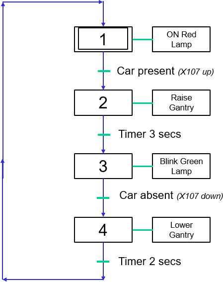

> **Related:** [[07-DASHBOARDS/NYPY3 - Main Index|NYPY3 Index]] | [[Lab procedures|I/O & timers]] | [[Lecture_1_PLC|PLC flowchart → ladder]] | [[23S2 EGE351 Tutorial 4 Combination Traffic Light|cascading latch ref]] | [[23S2 EGE351 Lab 4 - Automation .md|Lab 4]] | [[07-DASHBOARDS/Schedule & Assessments Dashboard|Assessments]]
> **PDF:** [[99-ATTACHMENTS/EGE351/24S1_EGE351 Lab 6 - SFC & Ladder Diagram_v2.pdf]] · **Flowchart image:** [[99-ATTACHMENTS/EGE351/EGE351-Lab6-flowchart.png]]

# EGE351 Lab 6 — Sequential Function Chart & Ladder Programming

> [!ingest] source: 24S1_EGE351 Lab 6 - SFC & Ladder Diagram_v2.pdf | date: 2026-05-26 | tool: markitdown
> Auto-converted. Flowchart extracted from PDF page 2 (image). Edit summary below.

## Summary

Convert the **SFC / PLC flowchart** (car + gantry sequence) to **ladder** on **FP7**, download, test, then apply three modifications (blink red at step 4, blink green while gantry raised, countdown counter at step 3). Uses **cascading step latches** (same pattern as [[23S2 EGE351 Tutorial 4 Combination Traffic Light|Tutorial 4 traffic light]]). I/O from [[Lab procedures#I/O Address Assignment Table]].

---

## Objectives

- a) Convert PLC flowchart → ladder diagram
- b) Program and run the sequential program
- c) Know the two parts of a PLC flowchart — **sequence** (steps/transitions) and **output** (actions)

## Equipment

- PLC **FP7** · Panel Box I/O

---

## SFC flowchart (from lab sheet)



| Step | Action (output) | Transition (to next step) |
|------|-----------------|---------------------------|
| **1** *(initial)* | **ON Red Lamp** | Car present — **X107 UP** |
| **2** | **Raise Gantry** | **Timer 3 s** |
| **3** | **Blink Green Lamp** | Car absent — **X107 DOWN** |
| **4** | **Lower Gantry** | **Timer 2 s** → loop to **Step 1** |

**Cycle:** 1 → 2 → 3 → 4 → 1 …

---

## Suggested I/O mapping

From [[Lab procedures]] (confirm on your panel):

| Function | Address | Notes |
|----------|---------|-------|
| Car present switch | **X107** | UP = car present; DOWN = car absent |
| Red lamp | **Y120** | LED4 |
| Green lamp | **Y122** | LED2 — blink with **SR1C** or timer in Lab 2 style |
| Raise gantry | **Y124** | RELAY-1 (left gantry up) — confirm L/R on bench |
| Lower gantry | **Y125** | RELAY-2 (left gantry down) |
| PB1 (mods task 5) | **X103** | Counter reset |
| Step latches | **R1–R4** | One internal relay per active step |

---

## Ladder approach — cascading step latches

Same structure as Tutorial 4 traffic light: each step = **one latch rung** + **output rung(s)** + **timer/transition rung**.

Use internal relays **R1 = Step 1**, **R2 = Step 2**, **R3 = Step 3**, **R4 = Step 4**.

### Step latch rungs (core — Task 1)

```
Rung 1 — Latch Step 1 (Red lamp stage):
|--[/R4]--[T4]-----------------+------------------(R1)--|
|   (return from step 4)        |
+--[R1]--[/R2]------------------+

Rung 2 — Output Step 1:
|--[R1]--------------------------------------------(Y120)--|

Rung 3 — Transition 1→2 (car present):
|--[R1]--[X107]------------------------------------(R2)--|   ← SET R2; R1 drops via [/R2] on Rung 1
|  (or use full latch rung below)

Rung 3 alt — Latch Step 2 (Raise gantry):
|--[R1]--[X107]-----------------+------------------(R2)--|
|                               |
+--[R2]--[/R3]------------------+

Rung 4 — Output Step 2:
|--[R2]--------------------------------------------(Y124)--|   ← Raise gantry

Rung 5 — Timer 3 s at Step 2:
|--[R2]-----------------------------[TMY1 | U3]--|

Rung 6 — Latch Step 3 (Blink green) — after T1:
|--[T1]--------------------------+------------------(R3)--|
|                               |
+--[R3]--[/R4]------------------+

Rung 7 — Output Step 3 (blink green — base task):
|--[R3]--[SR1C]------------------------------------(Y122)--|

Rung 8 — Transition 3→4 (car absent):
|--[R3]--[/X107]-----------------------------------(R4)--|   ← X107 down = NC contact [/X107]

Rung 9 alt — Latch Step 4 (Lower gantry):
|--[R3]--[/X107]-----------------+------------------(R4)--|
|                               |
+--[R4]--[/R1]------------------+

Rung 10 — Output Step 4:
|--[R4]--------------------------------------------(Y125)--|   ← Lower gantry

Rung 11 — Timer 2 s at Step 4 → back to Step 1:
|--[R4]-----------------------------[TMY2 | U2]--|
```
*(Refine contacts to match FPWIN GR7 syntax on bench; timer contacts T1/T2 per your timer numbers.)*

### Operation summary

1. **Step 1:** Red ON until **X107 UP** (car present).
2. **Step 2:** Gantry raises; after **3 s** → Step 3.
3. **Step 3:** Green blinks until **X107 DOWN** (car absent).
4. **Step 4:** Gantry lowers; after **2 s** → back to Step 1.

---

## Lab tasks

| # | Task | Notes |
|---|------|-------|
| 1 | Convert flowchart → ladder | Core sequence above |
| 2 | Download & test | FPWIN GR7 · [[Lab procedures#Lab PC Login]] |
| 3 | **Modify:** blink **Red Lamp** at **Step 4** | Add `Y120` + **SR1C** (or timer) on **R4** rung, same as green blink at Step 3 |
| 4 | **Modify:** blink **Green Lamp** when **Gantry is raised** | Blink **Y122** while **R2** (Step 2 — gantry up), not only at Step 3 |
| 5 | **Modify:** **countdown counter** at Step 3 | Preset **30**; decrement while green blinking; **reset with PB1 (X103)**; display value on monitor |

---

## Modification hints

**Task 3 — Red blink at Step 4:**
```
|--[R4]--[SR1C]------------------------------------(Y120)--|
```
(Gantry lowering + red blinking simultaneously.)

**Task 4 — Green blink while gantry raised (Step 2):**
```
|--[R2]--[SR1C]------------------------------------(Y122)--|
```
(May overlap with Step 3 green blink — clarify with instructor if both rungs drive Y122 or use separate logic.)

**Task 5 — Counter countdown at Step 3:**
- Use counter instruction; preset **U30**; clock pulse while **R3** and green blink active
- Reset input: **X103 (PB1)**
- Display: FPWIN monitor / counter current value register

---

## Related patterns in vault

- **Cascading latches:** [[23S2 EGE351 Tutorial 4 Combination Traffic Light#Solution]]
- **Blinking:** [[14S1 EGE351 Lab 2 - Automation - PLC Programming 2_v1-1#Task 2: Blinking LED with Timer (Rung 6 & 12)]]
- **Gantry I/O:** [[Lab procedures#Outputs]]
- **Switch-triggered handoff (not timer):** sequential latch chain — see chat notes / Tutorial 4 pattern with **X107** instead of **T1**

---

## Checklist

- [ ] Task 1 ladder matches SFC steps 1–4
- [ ] X107 UP/DOWN transitions tested
- [ ] Timers 3 s (step 2) and 2 s (step 4)
- [ ] Task 3 — red blink at step 4
- [ ] Task 4 — green blink while gantry raised
- [ ] Task 5 — counter 30, PB1 reset, monitor display
