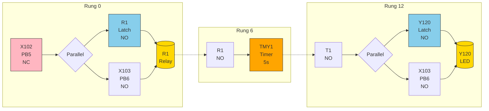

# Operation

- ]----[ ]------( )----|
```

**Operation:** Press PB3 (X101) to turn on internal relay R1. R1 activates timer SR1C which controls Y121 blinking at 1Hz. Press PB4 (X100) to turn off R1 and stop the blinking.

---

### Task 3: Delayed Turn-On (Rung 0 & 6)

**I/O Mapping:**
- PB5 → X102 (Normally Closed in circuit)
- PB6 → X103 (Normally Open)
- LED → Y120
- Timer → TMY1 (U5 = 5 seconds)

<details>
<summary>Ladder Diagram (Mermaid - Click to expand)</summary>



</details>

**Ladder Diagram (ASCII):**
```
Rung 0:
     X102           R1
|----[ ]--------+---( )----|
|               |
|     R1   X103 |
|----[ ]----[/]-+

Rung 6:
     R1
|----[ ]----[TMY1][U5]--------|

Rung 12:
     T1              Y120
|----[ ]---------+---- <!-- id:7111c010-e752-4ccf-8239-1a3ce3a958de ts:2026-05-17 07:49 -->
- ]----[ ]------( )----|
```

**Operation:** Press PB3 (X101) to turn on internal relay R1. R1 activates timer SR1C which controls Y121 blinking at 1Hz. Press PB4 (X100) to turn off R1 and stop the blinking.

---

### Task 3: Delayed Turn-On (Rung 0 & 6)

**I/O Mapping:**
- PB5 → X102 (Normally Closed in circuit)
- PB6 → X103 (Normally Open)
- LED → Y120
- Timer → TMY1 (U5 = 5 seconds)

<details>
<summary>Ladder Diagram (Mermaid - Click to expand)</summary>


</details>

**Ladder Diagram (ASCII):**
```
Rung 0:
     X102           R1
|----[ ]--------+---( )----|
|               |
|     R1   X103 |
|----[ ]----[/]-+

Rung 6:
     R1
|----[ ]----[TMY1][U5]--------|

Rung 12:
     T1              Y120
|----[ ]---------+---- <!-- id:7111c010-e752-4ccf-8239-1a3ce3a958de ts:2026-05-17 07:49 -->
