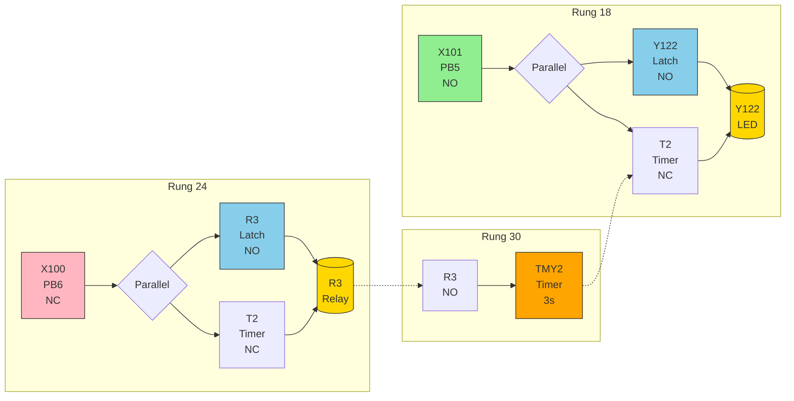

# R1 X103

- |
|     R1   X103 |
|----[ ]----[/]-+

Rung 6:
     R1
|----[ ]----[TMY1][U5]--------|

Rung 12:
     T1              Y120
|----[ ]---------+----( )----|
|                |
|   Y120    X103 |
|----[ ]----[/]--+
```

**Operation:** Press PB5 (X102) to turn on internal relay R1. R1 activates timer TMY1 which times for 5 seconds before turning on Y120. Press PB6 (X103) to turn off R1 and reset the timer.

---

### Task 4: Delayed Turn-Off (Rung 18, 24 & 30)

**I/O Mapping:**
- PB5 → X101 (Normally Open)
- PB6 → X100 (Normally Closed)
- LED → Y122
- Timer → TMY2 (U3 = 3 seconds)

<details>
<summary>Ladder Diagram (Mermaid - Click to expand)</summary>



</details>

** <!-- id:e7b99e84-6e58-4ca7-bf57-daa9a7d73daf ts:2026-05-17 07:49 -->
- |
|     R1   X103 |
|----[ ]----[/]-+

Rung 6:
     R1
|----[ ]----[TMY1][U5]--------|

Rung 12:
     T1              Y120
|----[ ]---------+----( )----|
|                |
|   Y120    X103 |
|----[ ]----[/]--+
```

**Operation:** Press PB5 (X102) to turn on internal relay R1. R1 activates timer TMY1 which times for 5 seconds before turning on Y120. Press PB6 (X103) to turn off R1 and reset the timer.

---

### Task 4: Delayed Turn-Off (Rung 18, 24 & 30)

**I/O Mapping:**
- PB5 → X101 (Normally Open)
- PB6 → X100 (Normally Closed)
- LED → Y122
- Timer → TMY2 (U3 = 3 seconds)

<details>
<summary>Ladder Diagram (Mermaid - Click to expand)</summary>


</details>

** <!-- id:e7b99e84-6e58-4ca7-bf57-daa9a7d73daf ts:2026-05-17 07:49 -->
