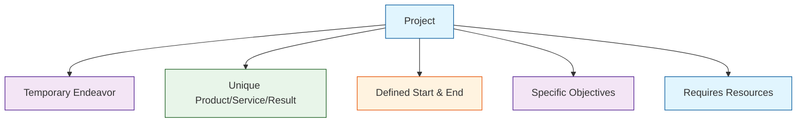

# Related Week 1Week

- > 📚 **Related:** [[Week 1|Week 1 Overview]] | [[Chap2_ProjectMgt|Chapter 2: Project Management]]

---

# Tutorials 1
Q1: Define a project. You shoudl provide an illustation in support of your definition
A: A project is a temporary endeavor undertaken to create a unique product, service, or result. It has a defined beginning and end, specific objectives, and requires resources. Projects are distinct from ongoing operations because they have a clear scope and deliverables.

Diagram:

Q2: Illustrate witha n example for each of teh follwing:
Duration of your project schedule is decreased
A: Deadline moved up
Budget (cost) of your project is decreased
A: Budget cut, price hike, tariff increase
your project scope is increased
A: client requests more features

Q3: It is state that building a custom house is a project but building the stadnard hosue is a business procss. Compare and contrast a project and busness process.
A: A project has a clear start and end, is a "one off", and has unique end prouct. <!-- id:156685c0-1af1-445d-ae11-25a1c74ce4f6 ts:2026-05-17 07:49 -->
- > 📚 **Related:** [[Week 1|Week 1 Overview]] | [[Chap2_ProjectMgt|Chapter 2: Project Management]]

---

# Tutorials 1
Q1: Define a project. You shoudl provide an illustation in support of your definition
A: A project is a temporary endeavor undertaken to create a unique product, service, or result. It has a defined beginning and end, specific objectives, and requires resources. Projects are distinct from ongoing operations because they have a clear scope and deliverables.

Diagram:

Q2: Illustrate witha n example for each of teh follwing:
Duration of your project schedule is decreased
A: Deadline moved up
Budget (cost) of your project is decreased
A: Budget cut, price hike, tariff increase
your project scope is increased
A: client requests more features

Q3: It is state that building a custom house is a project but building the stadnard hosue is a business procss. Compare and contrast a project and busness process.
A: A project has a clear start and end, is a "one off", and has unique end prouct. <!-- id:156685c0-1af1-445d-ae11-25a1c74ce4f6 ts:2026-05-17 07:49 -->
