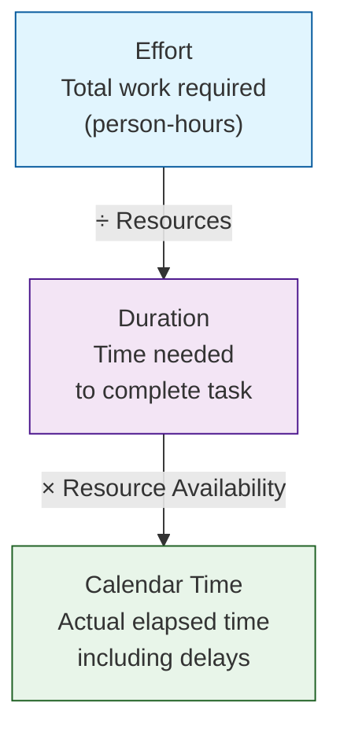

# The Relationship Of The Following

- the relationship of the following: effor, duration, Calendar time

A: Duration approximation relies on **previous experience and documented history**. Key principles:
- Durations are assigned by the **owners** of the tasks
- Padding should be avoided — use the **most likely duration**
- All assumptions should be documented
- Number of persons and training requirements should be documented

The relationship between Effort, Duration, and Calendar Time:
- **Effort** — total work required (person-hours); used for charging purposes (what does charging purposes mean?) (ANs: like salary etc -> paying ppl)
- **Duration** — time needed to complete the task; used for schedule purposes (considers productivity & wait time). Derived from Effort ÷ Resources
- **Calendar Time** — actual elapsed real-world time; used for planning and tracking (considers non-working days, weekends, holidays). Derived from Duration × Resource Availability

Diagram:

Q4 State the areas covered by teh project execution, control, and monitoring. <!-- id:afe699a5-4e59-49e9-b526-b18b00793c73 ts:2026-05-17 07:49 -->
- the relationship of the following: effor, duration, Calendar time

A: Duration approximation relies on **previous experience and documented history**. Key principles:
- Durations are assigned by the **owners** of the tasks
- Padding should be avoided — use the **most likely duration**
- All assumptions should be documented
- Number of persons and training requirements should be documented

The relationship between Effort, Duration, and Calendar Time:
- **Effort** — total work required (person-hours); used for charging purposes (what does charging purposes mean?) (ANs: like salary etc -> paying ppl)
- **Duration** — time needed to complete the task; used for schedule purposes (considers productivity & wait time). Derived from Effort ÷ Resources
- **Calendar Time** — actual elapsed real-world time; used for planning and tracking (considers non-working days, weekends, holidays). Derived from Duration × Resource Availability

Diagram:

Q4 State the areas covered by teh project execution, control, and monitoring. <!-- id:afe699a5-4e59-49e9-b526-b18b00793c73 ts:2026-05-17 07:49 -->
