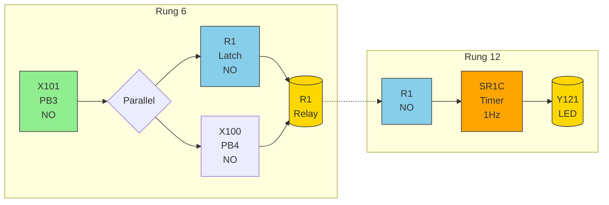

# X102

- -|
|           |
|     /X102 |
|----[ ]----+
```

**Operation:** Press PB1 (X103) to turn on Y120. Y120 latches itself on through the parallel branch. Press PB2 (X102) to break the latch and turn off Y120.

---

### Task 2: Blinking LED with Timer (Rung 6 & 12)

**I/O Mapping:**
- PB3 → X101 (Normally Open)
- PB4 → X100 (Normally Open)
- LED → Y121
- Timer → SR1C

<details>
<summary>Ladder Diagram (Mermaid - Click to expand)</summary>



</details>

**Ladder Diagram (ASCII):**
```
Rung 6:
     X101      R1      R1
|----[ ]----+----[ ]----( )----|
|          |
|     X100 |
|----[ ]----+

Rung 12:
     R1     SR1C     Y121
|----[ ]----[ ]------( )----|
```

**Operation:** Press PB3 (X101) to turn on internal relay R1. R1 activates timer SR1C which controls Y121 blinking at 1Hz. <!-- id:01319863-daec-4d9c-9ed7-6fbeece04ddc ts:2026-05-17 07:49 -->
- -|
|           |
|     /X102 |
|----[ ]----+
```

**Operation:** Press PB1 (X103) to turn on Y120. Y120 latches itself on through the parallel branch. Press PB2 (X102) to break the latch and turn off Y120.

---

### Task 2: Blinking LED with Timer (Rung 6 & 12)

**I/O Mapping:**
- PB3 → X101 (Normally Open)
- PB4 → X100 (Normally Open)
- LED → Y121
- Timer → SR1C

<details>
<summary>Ladder Diagram (Mermaid - Click to expand)</summary>


</details>

**Ladder Diagram (ASCII):**
```
Rung 6:
     X101      R1      R1
|----[ ]----+----[ ]----( )----|
|          |
|     X100 |
|----[ ]----+

Rung 12:
     R1     SR1C     Y121
|----[ ]----[ ]------( )----|
```

**Operation:** Press PB3 (X101) to turn on internal relay R1. R1 activates timer SR1C which controls Y121 blinking at 1Hz. <!-- id:01319863-daec-4d9c-9ed7-6fbeece04ddc ts:2026-05-17 07:49 -->
